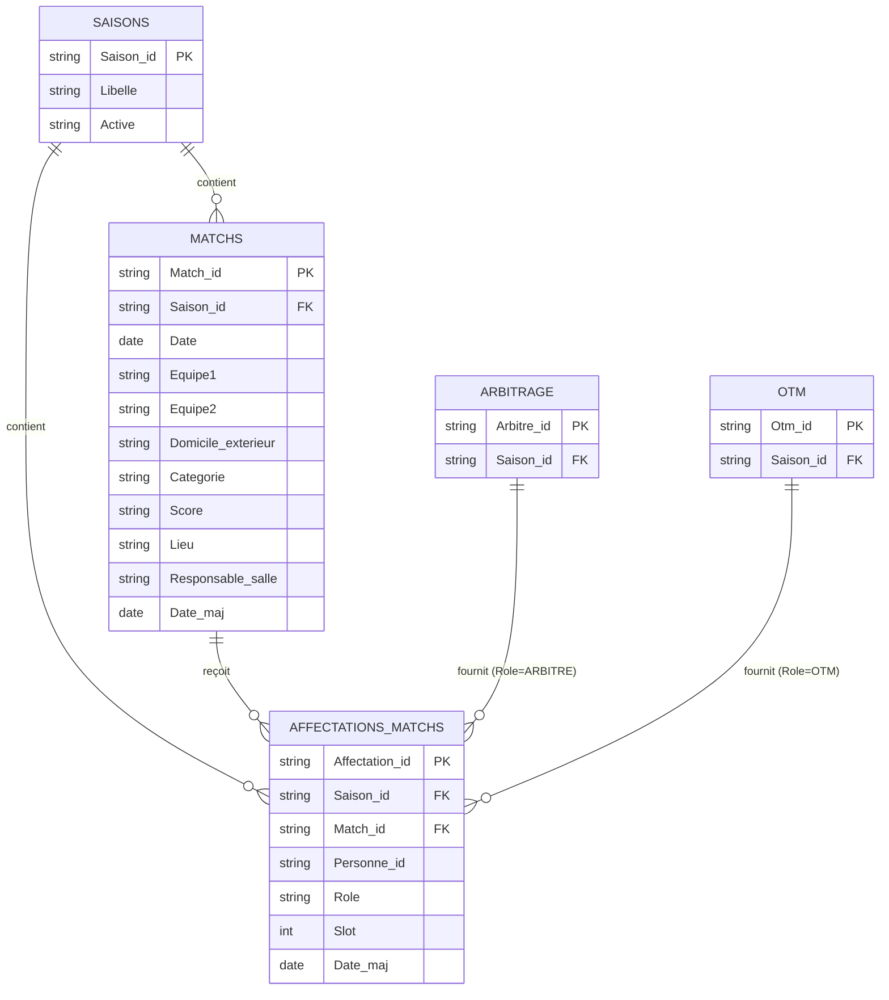
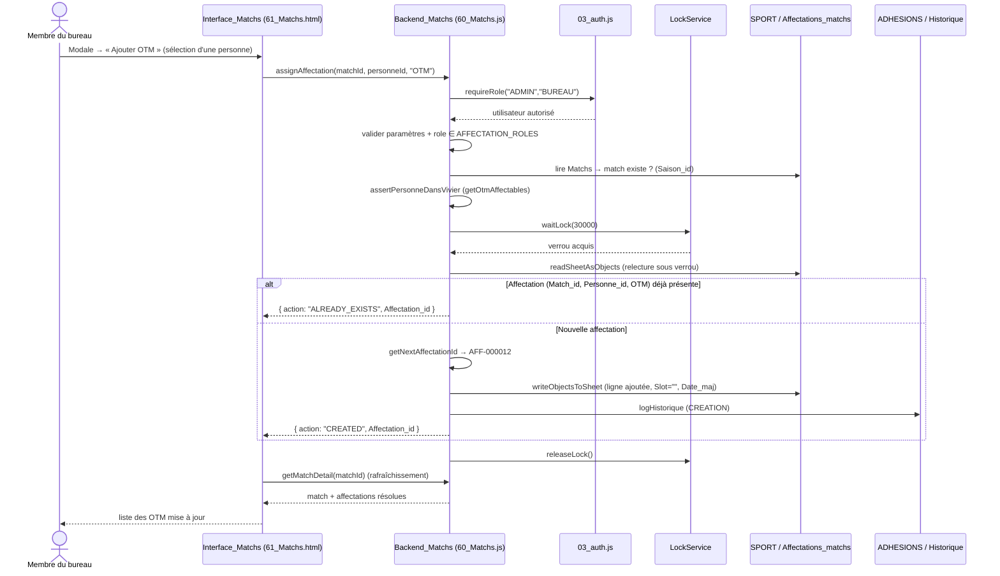

# Design Document — Module Matchs (affectation arbitres & OTM)

## Introduction

Ce document décrit la conception du module **Matchs** de l'application US Aussonne Basket
(Google Apps Script Web App adossée à Google Sheets). Le module répond au besoin
« Qui arbitre quel match ? » : afficher les matchs d'une saison, consulter/modifier leurs
données, et affecter ou retirer des personnes (arbitre, OTM, responsable de salle) selon un
modèle d'affectations **générique**.

La conception suit strictement les conventions déjà en place dans le dépôt :

- Numérotation des fichiers : backend `60_Matchs.js`, frontend `61_Matchs.html`
  (le `50` est réservé au module OTM).
- Accès aux colonnes **par nom d'en-tête** via `readSheetAsObjects(sheet)` → `{ headers, rows }`
  et écriture via `writeObjectsToSheet(sheet, headers, rows)` (helpers déjà définis dans
  `20_Adhesions.js`).
- Contrôle des droits côté serveur avec `requireAuthorizedUser()` / `requireRole(...)`
  (`03_auth.js`).
- Écritures protégées par `LockService.getScriptLock().waitLock(30000)` avec **relecture
  après acquisition du verrou**, puis `releaseLock()` dans un `finally`
  (pattern de `30_Arbitrage.js`).
- Sérialisation ISO des dates vers le client (pattern `formatArbitrageDateForClient`).
- Génération d'identifiants `PREFIX-` + numéro à six chiffres (pattern `getNextArbitreId`).
- Rattachement systématique des données saisonnières à un `Saison_id`.

**Hors périmètre** : l'import automatique des matchs (FBI/FFBB). Les matchs sont saisis
manuellement dans l'onglet `Matchs` du classeur `SPORT` (voir la section
[Saisie manuelle des matchs](#saisie-manuelle-des-matchs)). Le module se concentre sur
l'affichage, la modification et la gestion des affectations.

Le langage utilisé pour les exemples est **JavaScript (Google Apps Script)**, conforme au
reste du dépôt.

---

## Architecture

### Vue d'ensemble

Le module reprend l'architecture en couches déjà appliquée aux modules Arbitrage et Adhésions.

```
Navigateur (61_Matchs.html + bloc Matchs de 92_Scripts.html)
        │  google.script.run.withSuccessHandler(...).withFailureHandler(...)
        ▼
Backend Apps Script (60_Matchs.js)
   ├─ Contrôle d'accès      → 03_auth.js (requireRole / requireAuthorizedUser)
   ├─ Lecture/écriture      → 20_Adhesions.js (readSheetAsObjects / writeObjectsToSheet)
   ├─ Vivier arbitres       → 30_Arbitrage.js (getArbitres)
   ├─ Vivier OTM            → 50_OTM.js (getOtm, future ; fallback vide pour l'instant)
   ├─ Config/constantes     → 00_Config.js (SPREADSHEETS, SHEETS, MATCHS_LIEUX, …)
   └─ Historique            → onglet Historique du classeur ADHESIONS
        ▼
Google Sheets
   ├─ SPORT   : onglets Matchs, Affectations_matchs, Arbitrage
   └─ ADHESIONS : onglets Saisons, Contacts, Historique
```

### Décisions de conception

1. **Modèle d'affectations générique avec slot.** Une seule table `Affectations_matchs` avec
   un champ `Role` (valeurs `ARBITRE`, `OTM`, `RESPONSABLE_SALLE`) plutôt que des colonnes
   `Arbitre_1`, `OTM_1`, … dans `Matchs`. Cela permet un nombre variable d'affectations par
   match et par rôle, et simplifie les statistiques par personne. Une colonne `Slot`
   (Option B retenue) complète ce modèle : pour les affectations `ARBITRE`, `Slot` vaut `1`
   ou `2` et identifie respectivement « Arbitre 1 » et « Arbitre 2 ». Pour les rôles sans
   position suivie (OTM : multi-lignes sans slot fixe pour l'instant) et pour
   `RESPONSABLE_SALLE`, `Slot` reste vide ou `0`. La **clé fonctionnelle d'unicité** d'un
   arbitre positionné devient `(Match_id, Role=ARBITRE, Slot)` : un slot héberge au plus un
   arbitre et l'affectation d'un nouvel arbitre sur un slot occupé **remplace** le précédent.
   La clé `(Match_id, Personne_id, Role)` reste en vigueur et empêche d'affecter deux fois le
   même arbitre (donc sur les deux slots) au même match.

2. **Réutilisation du vivier arbitres.** Le backend n'implémente pas sa propre lecture du
   vivier : `getArbitresAffectables(saisonId)` appelle directement `getArbitres(saisonId)`
   de `30_Arbitrage.js` et projette un sous-ensemble de champs. Toute évolution du vivier
   reste centralisée dans le module Arbitrage.

3. **Dépendance OTM optionnelle.** Le module OTM (`50_OTM.js`) est vide. Le backend tente
   d'appeler `getOtm(saisonId)` si la fonction existe (`typeof getOtm === "function"`) et
   retourne sinon une liste vide, **sans erreur** (exigence 8.7).

4. **Enums déclarés comme constantes.** `MATCHS_LIEUX` et les catégories (réutilisées
   d'Arbitrage) sont déclarés dans `00_Config.js`. Les valeurs techniques (stables, sans
   accent ni espace) sont séparées des libellés d'affichage, gérés côté client.

5. **Noms de feuilles centralisés.** Pour éviter les chaînes magiques dispersées, on
   introduit un objet `SHEETS` dans `00_Config.js`. Les helpers existants continuent de
   fonctionner (ils reçoivent toujours un objet `Sheet`), on ne change pas leur signature.

6. **Historique mutualisé.** On ajoute un helper générique `logHistorique(entries)` dans
   `60_Matchs.js` qui écrit dans l'onglet `Historique` du classeur `ADHESIONS` au même
   format 9 colonnes que `writeAdhesionHistory` (date, email, module, objet, référence,
   action, champ, ancienne valeur, nouvelle valeur). On réutilise `serializeHistoryValue`
   déjà exporté par `20_Adhesions.js`.

---

## Modèle de données

### Diagramme des relations



### Table `Matchs` (classeur SPORT)

En-têtes stables, sans accent ni espace, conformes à la convention du dépôt.

| Colonne              | Type (Sheets) | Description                                                                  |
| -------------------- | ------------- | ---------------------------------------------------------------------------- |
| `Match_id`           | Texte         | Identifiant interne `MAT-000001`. Clé primaire.                              |
| `Saison_id`          | Texte         | Rattachement saison (ex. `2026-2027`). Obligatoire.                          |
| `Date`               | Date          | Date (et heure) de la rencontre. Sérialisée en ISO vers le client.           |
| `Equipe1`            | Texte         | Équipe du club (ou première équipe).                                         |
| `Equipe2`            | Texte         | Équipe adverse.                                                              |
| `Domicile_exterieur` | Texte         | `DOMICILE` ou `EXTERIEUR` (indicateur de réception).                         |
| `Categorie`          | Texte         | Catégorie, parmi `MATCHS_CATEGORIES` (réutilise Arbitrage).                  |
| `Score`              | Texte         | Score libre (ex. `62-58`), vide tant que non joué.                           |
| `Lieu`               | Texte         | Lieu, parmi `MATCHS_LIEUX` (`PIERRE_DENIS`, `GERMAINE_TILLON`, `EXTERIEUR`). |
| `Responsable_salle`  | Texte         | Nom libre du responsable de salle (champ texte, pas une affectation).        |
| `Date_maj`           | Date          | Horodatage de dernière modification. Mis à jour à chaque écriture.           |

> Remarque : `Responsable_salle` existe à la fois comme champ texte libre sur le match (saisie
> rapide) **et** comme `Role` possible dans `Affectations_matchs` (`RESPONSABLE_SALLE`) pour les
> cas où le responsable est une personne du vivier. Le modèle générique supporte les deux ;
> l'UI de ce module expose l'édition du champ texte et l'affectation ARBITRE/OTM.

### Table `Affectations_matchs` (classeur SPORT)

| Colonne          | Type (Sheets) | Description                                                           |
| ---------------- | ------------- | --------------------------------------------------------------------- |
| `Affectation_id` | Texte         | Identifiant interne `AFF-000001`. Clé primaire.                       |
| `Saison_id`      | Texte         | Hérité du `Saison_id` du match. Obligatoire.                          |
| `Match_id`       | Texte         | Référence vers `Matchs.Match_id`. Obligatoire.                        |
| `Personne_id`    | Texte         | `Arbitre_id` (vivier arbitres) ou identifiant OTM selon le rôle.      |
| `Role`           | Texte         | `ARBITRE`, `OTM` ou `RESPONSABLE_SALLE`.                              |
| `Slot`           | Nombre        | Position d'arbitre : `1` ou `2` pour `Role=ARBITRE` ; vide/`0` sinon. |
| `Date_maj`       | Date          | Horodatage de création/modification.                                  |

> Ordre exact des en-têtes : `Affectation_id, Saison_id, Match_id, Personne_id, Role, Slot,
Date_maj`. La colonne `Slot` est insérée **avant** `Date_maj`.

**Clés fonctionnelles d'unicité** :

- `(Match_id, Role=ARBITRE, Slot)` : un slot d'arbitre (`1` ou `2`) héberge **au plus un**
  arbitre. Affecter un arbitre à un slot déjà occupé **remplace** l'occupant précédent
  (exigence 6.7) ; fixer un `Personne_id` vide **libère** le slot (exigence 6.8).
- `(Match_id, Personne_id, Role)` : deux affectations avec le même triplet sont interdites
  (idempotence de l'exigence 8.5). Appliqué au rôle `ARBITRE`, ce triplet garantit qu'un même
  arbitre ne peut pas occuper les deux slots d'un même match (exigence 6.10).

### Onglet `Saisons` (classeur ADHESIONS)

Lu en lecture seule par le module. Colonnes utilisées : `Saison_id`, `Libelle`, `Active`
(valeur `Oui` pour la saison active). La saison active est déterminée dynamiquement, jamais
codée en dur (exigence 2.4).

### Onglet `Historique` (classeur ADHESIONS)

Format identique à l'existant, 9 colonnes positionnelles :
`[Date, Email, Module, Objet, Reference, Action, Champ, Ancienne_valeur, Nouvelle_valeur]`.
Le module écrit `Module = "MATCHS"` et `Objet = "MATCH"` ou `"AFFECTATION"`.

---

## Constantes et configuration (`00_Config.js`)

Ajouts à `00_Config.js` :

```javascript
/**
 * Noms des onglets utilisés comme tables.
 * Centralisés pour éviter les chaînes magiques.
 */
const SHEETS = {
  MATCHS: "Matchs",
  AFFECTATIONS_MATCHS: "Affectations_matchs",
  ARBITRAGE: "Arbitrage",
  SAISONS: "Saisons",
  HISTORIQUE: "Historique",
};

/**
 * Lieux possibles d'un match.
 * Valeurs techniques stables (sans accent ni espace).
 * Les libellés d'affichage sont gérés côté client.
 */
const MATCHS_LIEUX = ["PIERRE_DENIS", "GERMAINE_TILLON", "EXTERIEUR"];

/**
 * Catégories d'un match.
 * Réutilise les catégories du module Arbitrage.
 */
const MATCHS_CATEGORIES = [
  "U13F",
  "U13M",
  "U15F",
  "U15M",
  "U18F",
  "U18M",
  "SENIORS_F",
  "SENIORS_M",
];

/**
 * Rôles d'affectation.
 */
const AFFECTATION_ROLES = ["ARBITRE", "OTM", "RESPONSABLE_SALLE"];
```

> `MATCHS_CATEGORIES` duplique volontairement la liste `ARBITRAGE_CATEGORIES_JOUEURS` plutôt
> que de référencer directement la constante d'un autre module : les deux listes ont la même
> valeur aujourd'hui mais répondent à des besoins métier distincts (vivier d'arbitrage vs
> catégories de matchs) et peuvent diverger. La validation côté serveur s'appuie sur
> `MATCHS_CATEGORIES`.

Côté client, les libellés d'affichage sont séparés des valeurs techniques :

```javascript
const matchsLieuLabels = {
  PIERRE_DENIS: "Pierre Denis",
  GERMAINE_TILLON: "Germaine Tillon",
  EXTERIEUR: "Extérieur",
};

const matchsRoleLabels = {
  ARBITRE: "Arbitre",
  OTM: "OTM",
  RESPONSABLE_SALLE: "Responsable de salle",
};
```

---

## API Backend (`60_Matchs.js`)

Toutes les fonctions appliquent le contrôle d'accès **en premier** (exigence 9.1). Les
fonctions de lecture utilisent `requireAuthorizedUser()` (COACH autorisé en lecture, exigence
9.2). Les fonctions d'écriture utilisent `requireRole("ADMIN", "BUREAU")` (exigences 5.1,
6.2, 7.1, 8.2, 9.3, 9.5). Toutes les dates renvoyées au client sont sérialisées en ISO via un
helper `formatMatchsDateForClient` (même logique que `formatArbitrageDateForClient`).

### Tableau récapitulatif

| Fonction                                       | Accès                      | Verrou | Rôle / effet                                                        |
| ---------------------------------------------- | -------------------------- | ------ | ------------------------------------------------------------------- |
| `getActiveSaison()`                            | `requireAuthorizedUser`    | non    | Retourne la saison active (`Oui`).                                  |
| `listSaisons()`                                | `requireAuthorizedUser`    | non    | Liste des saisons (`Saison_id`, `Libelle`, `Active`).               |
| `listMatchs(saisonId)`                         | `requireAuthorizedUser`    | non    | Matchs de la saison + comptes par rôle + arbitres slot 1/2 résolus. |
| `getMatchDetail(matchId)`                      | `requireAuthorizedUser`    | non    | Détail d'un match + ses affectations résolues (avec `Slot`).        |
| `updateMatch(payload)`                         | `requireRole ADMIN/BUREAU` | oui    | Modifie les données d'un match.                                     |
| `getArbitresAffectables(saisonId)`             | `requireRole ADMIN/BUREAU` | non    | Vivier arbitres (délègue à `getArbitres`).                          |
| `getOtmAffectables(saisonId)`                  | `requireAuthorizedUser`    | non    | Vivier OTM ou `[]` si module OTM absent.                            |
| `assignAffectation(matchId, personneId, role)` | `requireRole ADMIN/BUREAU` | oui    | Crée une affectation (idempotente) — OTM & modale.                  |
| `setArbitreSlot(matchId, slot, personneId)`    | `requireRole ADMIN/BUREAU` | oui    | Fixe / remplace / libère l'arbitre d'un slot (`1`/`2`).             |
| `removeAffectation(affectationId)`             | `requireRole ADMIN/BUREAU` | oui    | Supprime une affectation (idempotente).                             |

### Format de retour des écritures

Conforme au pattern Arbitrage : un objet explicite avec `success`, `action` et la référence
concernée (exigences 5.8, 7.5).

```javascript
// updateMatch
{ success: true, action: "UPDATED" | "UNCHANGED", Match_id: "MAT-000001" }
// assignAffectation
{ success: true, action: "CREATED" | "ALREADY_EXISTS", Affectation_id, Match_id, Personne_id, Role }
// setArbitreSlot
{ success: true, action: "SET" | "REPLACED" | "CLEARED" | "UNCHANGED", Match_id, Slot, Personne_id, Affectation_id }
// removeAffectation
{ success: true, action: "DELETED" | "ALREADY_ABSENT", Affectation_id }
```

### Détail des fonctions

#### `getActiveSaison()`

- Accès : `requireAuthorizedUser()`.
- Lit l'onglet `Saisons` (`getSheetData("ADHESIONS", SHEETS.SAISONS)`), sélectionne la ligne
  dont `Active` normalisé vaut `oui`. Retourne `{ Saison_id, Libelle, Active }`.
- Si aucune saison active : retourne `null` (l'UI invite alors à choisir une saison).
  Aucune valeur de saison n'est codée en dur (exigences 1.1, 2.4).

#### `listSaisons()`

- Accès : `requireAuthorizedUser()`.
- Retourne toutes les saisons `[{ Saison_id, Libelle, Active }]`, triées par `Saison_id`
  décroissant (exigence 2.2).

#### `listMatchs(saisonId)`

- Accès : `requireAuthorizedUser()`.
- Valide la présence de `saisonId` (exigences 11.1/11.2).
- Lit `Matchs` et `Affectations_matchs` via `readSheetAsObjects`. Filtre les matchs sur
  `Saison_id === saisonId` (exigence 1.2) et les affectations sur `Saison_id === saisonId`.
- Pour chaque match, calcule les comptes par rôle (exigence 1.5) :
  `{ ARBITRE: n1, OTM: n2, RESPONSABLE_SALLE: n3 }`.
- Pour chaque match, résout l'arbitre du **slot 1** et du **slot 2** (exigences 1.6, 1.7) :
  à partir des affectations `Role=ARBITRE` dont `Slot` vaut `1` ou `2`, on expose
  `Arbitre1_id` / `Arbitre1_nom` et `Arbitre2_id` / `Arbitre2_nom`. Le nom est résolu via le
  vivier arbitres (`getArbitres`) chargé **une seule fois** par appel ; si le `Personne_id`
  n'y figure plus, le nom retombe sur le `Personne_id`. Un slot inoccupé renvoie des chaînes
  vides.
- Le chargement du vivier arbitres est **dégradé en liste vide** si l'appel échoue (ex. COACH
  sans accès à `getArbitresAffectables`) : les noms retombent alors sur les `Personne_id`,
  sans empêcher le chargement de la liste.
- Sérialise `Date` et `Date_maj` en ISO (exigence 1.4). Trie par `Date` croissante.

```javascript
function listMatchs(saisonId) {
  requireAuthorizedUser();
  saisonId = String(saisonId || "").trim();
  if (!saisonId) {
    throw new Error("La saison est obligatoire.");
  }

  const sport = SpreadsheetApp.openById(SPREADSHEETS.SPORT);
  const matchsSheet = getRequiredSheet(sport, SHEETS.MATCHS);
  const affectSheet = getRequiredSheet(sport, SHEETS.AFFECTATIONS_MATCHS);

  const matchs = readSheetAsObjects(matchsSheet).rows.filter(
    (row) => String(row.Saison_id || "").trim() === saisonId,
  );

  const affectations = readSheetAsObjects(affectSheet).rows.filter(
    (row) => String(row.Saison_id || "").trim() === saisonId,
  );

  const countsByMatch = {};
  // slotsByMatch[matchId] = { 1: personneId, 2: personneId }
  const slotsByMatch = {};
  affectations.forEach((aff) => {
    const matchId = String(aff.Match_id || "").trim();
    const role = String(aff.Role || "").trim();
    if (!countsByMatch[matchId]) {
      countsByMatch[matchId] = { ARBITRE: 0, OTM: 0, RESPONSABLE_SALLE: 0 };
    }
    if (countsByMatch[matchId][role] !== undefined) {
      countsByMatch[matchId][role]++;
    }
    if (role === "ARBITRE") {
      const slot = String(aff.Slot || "").trim();
      if (slot === "1" || slot === "2") {
        if (!slotsByMatch[matchId]) slotsByMatch[matchId] = {};
        slotsByMatch[matchId][slot] = String(aff.Personne_id || "").trim();
      }
    }
  });

  // Vivier arbitres chargé une seule fois, dégradé en [] si indisponible.
  let arbitreNameById = {};
  try {
    (getArbitresAffectables(saisonId) || []).forEach((a) => {
      const id = String(a.Personne_id || "").trim();
      const nom = (
        String(a.Prenom || "").trim() +
        " " +
        String(a.Nom || "").trim()
      ).trim();
      if (id) arbitreNameById[id] = nom;
    });
  } catch (error) {
    arbitreNameById = {};
  }

  function resolveArbitreNom(personneId) {
    const id = String(personneId || "").trim();
    if (!id) return "";
    return arbitreNameById[id] || id; // fallback sur l'id (exigence 1.7)
  }

  return matchs
    .map((row) => {
      const matchId = String(row.Match_id || "").trim();
      const slots = slotsByMatch[matchId] || {};
      const arbitre1Id = slots["1"] || "";
      const arbitre2Id = slots["2"] || "";
      return {
        Match_id: row.Match_id || "",
        Saison_id: row.Saison_id || "",
        Date: formatMatchsDateForClient(row.Date),
        Equipe1: row.Equipe1 || "",
        Equipe2: row.Equipe2 || "",
        Domicile_exterieur: row.Domicile_exterieur || "",
        Categorie: row.Categorie || "",
        Score: row.Score || "",
        Lieu: row.Lieu || "",
        Responsable_salle: row.Responsable_salle || "",
        Date_maj: formatMatchsDateForClient(row.Date_maj),
        comptes: countsByMatch[matchId] || {
          ARBITRE: 0,
          OTM: 0,
          RESPONSABLE_SALLE: 0,
        },
        Arbitre1_id: arbitre1Id,
        Arbitre1_nom: resolveArbitreNom(arbitre1Id),
        Arbitre2_id: arbitre2Id,
        Arbitre2_nom: resolveArbitreNom(arbitre2Id),
      };
    })
    .sort((a, b) => String(a.Date).localeCompare(String(b.Date)));
}
```

#### `getMatchDetail(matchId)`

- Accès : `requireAuthorizedUser()`.
- Valide `matchId`. Recherche le match. S'il est introuvable, lève une erreur « match
  introuvable » (exigence 4.3).
- Récupère les affectations du match **filtrées sur le `Saison_id` du match** (exigences
  4.2, 10.4), et pour chacune résout le nom affichable à partir du vivier correspondant au
  rôle (arbitres via `getArbitres`, OTM via `getOtmAffectables`). Si la personne n'est plus
  dans le vivier, le nom affiché retombe sur le `Personne_id`.
- Chaque affectation retournée inclut sa valeur de `Slot` (exigences 4.2, 4.3). Pour une
  affectation `Role=ARBITRE`, `Slot` vaut `1` ou `2` (position « Arbitre 1 » / « Arbitre 2 »)
  ; pour les autres rôles, `Slot` est vide. L'objet retourné est donc
  `{ Affectation_id, Personne_id, Role, Slot, DisplayName }`.

#### `updateMatch(payload)`

- Accès : `requireRole("ADMIN", "BUREAU")` (exigences 5.1, 5.2).
- Validation (avant tout verrou) :
  - `payload.Match_id` présent (exigences 5.3, 11.1/11.2).
  - Si `payload.Lieu` renseigné : doit appartenir à `MATCHS_LIEUX`, sinon erreur de valeur
    invalide (exigence 5.4).
  - Si `payload.Categorie` renseignée : doit appartenir à `MATCHS_CATEGORIES` (exigence 5.5).
- Verrou `LockService` + **relecture** de `Matchs` après `waitLock` (exigence 5.6).
- Recherche la ligne par `Match_id`. Si absente → erreur. Compare champ par champ via
  `normalizeHistoryValue` : si aucune valeur ne change, retourne
  `{ success: true, action: "UNCHANGED", Match_id }` sans écrire (exigence 5.9, idempotence).
- Sinon applique les champs modifiables (`Date`, `Equipe1`, `Equipe2`, `Domicile_exterieur`,
  `Categorie`, `Score`, `Lieu`, `Responsable_salle`), met `Date_maj = new Date()` (exigence
  5.7), réécrit via `writeObjectsToSheet`, journalise les changements dans `Historique`
  (exigences 12.1, 12.2), puis retourne `{ success: true, action: "UPDATED", Match_id }`
  (exigence 5.8). `releaseLock()` dans le `finally`.

#### `getArbitresAffectables(saisonId)`

- Accès : `requireRole("ADMIN", "BUREAU")` (cohérent avec `getArbitres`, qui exige déjà ce
  rôle).
- Délègue à `getArbitres(saisonId)` et projette `{ Personne_id: Arbitre_id, Nom, Prenom,
Categorie, Niveau, Type }`, en ignorant les entrées sans `Arbitre_id`. Tout élément retourné
  porte le `Saison_id` demandé (exigence 6.1).

#### `getOtmAffectables(saisonId)`

- Accès : `requireAuthorizedUser()` (consultable aussi en lecture par COACH pour l'affichage).
- Fallback gracieux (exigence 8.7) :

```javascript
function getOtmAffectables(saisonId) {
  requireAuthorizedUser();
  saisonId = String(saisonId || "").trim();
  if (!saisonId) {
    return [];
  }
  // Le module OTM (50_OTM.js) n'est pas encore implémenté.
  if (typeof getOtm !== "function") {
    return [];
  }
  try {
    const otm = getOtm(saisonId) || [];
    return otm.map((o) => ({
      Personne_id: o.Otm_id || o.Personne_id || "",
      Nom: o.Nom || "",
      Prenom: o.Prenom || "",
    }));
  } catch (error) {
    // Dégradation : on n'empêche jamais l'ouverture de l'interface Matchs.
    console.warn("Vivier OTM indisponible : " + error.message);
    return [];
  }
}
```

#### `assignAffectation(matchId, personneId, role)`

- Accès : `requireRole("ADMIN", "BUREAU")` (exigences 6.2, 8.2).
- Validation (exigences 11.1–11.4) :
  - `matchId`, `personneId`, `role` présents et non vides.
  - `role` ∈ `AFFECTATION_ROLES` (exigence 11.3).
  - Le match existe pour la saison courante → on récupère son `Saison_id` (exigences 6.3,
    8.3). L'affectation héritera de ce `Saison_id` (exigences 10.1, 10.2).
  - `personneId` existe dans le vivier correspondant au rôle pour cette saison :
    `ARBITRE` → `getArbitresAffectables(saisonId)` ; `OTM` → `getOtmAffectables(saisonId)` ;
    `RESPONSABLE_SALLE` → non proposé à l'affectation par cette fonction dans ce module
    (le responsable de salle est un champ texte du match) ; si demandé, même mécanisme de
    validation d'existence (exigences 6.4, 8.3, 11.4).
- Verrou `LockService` + **relecture** de `Affectations_matchs` après `waitLock`, puis
  génération de l'`Affectation_id` et écriture (même pattern de verrou que l'exigence 6.11).
- **Idempotence** : si une ligne existe déjà pour `(Match_id, Personne_id, Role)`, aucune
  nouvelle ligne n'est créée et le retour est
  `{ success: true, action: "ALREADY_EXISTS", ... }` (exigence 8.5).
- Sinon crée la ligne complète (`Affectation_id`, `Saison_id`, `Match_id`, `Personne_id`,
  `Role`, `Slot`, `Date_maj`) (exigence 8.4), journalise dans `Historique` (action
  `CREATION`), et retourne `action: "CREATED"`.
- `assignAffectation` reste la voie générique utilisée par la **modale** (notamment pour les
  OTM) : elle écrit `Slot = ""` (aucune position suivie). La désignation **positionnée** d'un
  arbitre (slot `1` / `2`) depuis le tableau passe par `setArbitreSlot` (ci-dessous).

```javascript
function assignAffectation(matchId, personneId, role) {
  requireRole("ADMIN", "BUREAU");

  matchId = String(matchId || "").trim();
  personneId = String(personneId || "").trim();
  role = String(role || "")
    .trim()
    .toUpperCase();

  if (!matchId) throw new Error("Le Match_id est obligatoire.");
  if (!personneId) throw new Error("Le Personne_id est obligatoire.");
  if (!role) throw new Error("Le rôle est obligatoire.");
  if (!AFFECTATION_ROLES.includes(role)) {
    throw new Error("Rôle d'affectation invalide : " + role);
  }

  const sport = SpreadsheetApp.openById(SPREADSHEETS.SPORT);
  const matchsSheet = getRequiredSheet(sport, SHEETS.MATCHS);

  // Existence du match + saison de rattachement.
  const match = readSheetAsObjects(matchsSheet).rows.find(
    (row) => String(row.Match_id || "").trim() === matchId,
  );
  if (!match) throw new Error("Match introuvable : " + matchId);
  const saisonId = String(match.Saison_id || "").trim();

  // Existence de la personne dans le vivier du rôle.
  assertPersonneDansVivier(personneId, role, saisonId);

  const affectSheet = getRequiredSheet(sport, SHEETS.AFFECTATIONS_MATCHS);
  const lock = LockService.getScriptLock();
  lock.waitLock(30000);
  try {
    const data = readSheetAsObjects(affectSheet); // relecture sous verrou
    const headers = data.headers;
    const rows = data.rows;

    const existing = rows.find(
      (row) =>
        String(row.Match_id || "").trim() === matchId &&
        String(row.Personne_id || "").trim() === personneId &&
        String(row.Role || "")
          .trim()
          .toUpperCase() === role,
    );
    if (existing) {
      return {
        success: true,
        action: "ALREADY_EXISTS",
        Affectation_id: existing.Affectation_id,
        Match_id: matchId,
        Personne_id: personneId,
        Role: role,
      };
    }

    const affectationId = getNextAffectationId(rows);
    const now = new Date();
    rows.push({
      Affectation_id: affectationId,
      Saison_id: saisonId,
      Match_id: matchId,
      Personne_id: personneId,
      Role: role,
      Slot: "", // voie générique : aucune position suivie (OTM, modale)
      Date_maj: now,
    });

    writeObjectsToSheet(affectSheet, headers, rows);
    logHistorique([
      {
        objet: "AFFECTATION",
        reference: affectationId,
        action: "CREATION",
        field: "Role",
        oldValue: "",
        newValue: role,
      },
    ]);

    return {
      success: true,
      action: "CREATED",
      Affectation_id: affectationId,
      Match_id: matchId,
      Personne_id: personneId,
      Role: role,
    };
  } finally {
    lock.releaseLock();
  }
}
```

#### `setArbitreSlot(matchId, slot, personneId)`

Désignation **positionnée** d'un arbitre sur un slot (`1` ou `2`) d'un match. C'est la
fonction appelée par les listes déroulantes en ligne « Arbitre 1 » / « Arbitre 2 » du tableau
(sauvegarde immédiate au changement). `assignAffectation` / `removeAffectation` restent
utilisées par la modale et pour les OTM.

- Accès : `requireRole("ADMIN", "BUREAU")` en premier (exigences 6.2, 9.5).
- Validation (avant verrou) :
  - `matchId` présent et non vide (exigences 6.3, 11.1/11.2).
  - `slot` normalisé en nombre entier et ∈ `{1, 2}` ; sinon erreur de valeur invalide
    (exigences 6.4, 11.5).
  - Le match existe → on récupère son `Saison_id` (exigence 6.3). L'affectation héritera de ce
    `Saison_id` (exigences 10.1, 10.2).
  - `personneId` peut être **vide** (libération du slot — exigence 6.8). S'il est non vide, il
    doit exister dans le vivier arbitres de la saison via
    `assertPersonneDansVivier(personneId, "ARBITRE", saisonId)` (exigence 6.5).
- Verrou `LockService.getScriptLock().waitLock(30000)` + **relecture** de
  `Affectations_matchs` sous verrou (exigence 6.11) ; `releaseLock()` dans `finally`.
- Logique sous verrou (sur les affectations `Role=ARBITRE` du match) :
  - Localiser l'occupant courant du slot ciblé (`current` : la ligne `ARBITRE` dont `Slot`
    vaut le slot demandé) et, le cas échéant, la ligne où le `personneId` demandé est déjà
    arbitre sur ce match (`sameRef`).
  - **Idempotence** (exigence 6.9) : si `current` existe et que son `Personne_id` est égal au
    `personneId` demandé → `{ action: "UNCHANGED" }` sans écriture.
  - **Même arbitre sur l'autre slot** (exigence 6.10) : si `personneId` non vide et que
    `sameRef` existe sur l'**autre** slot → erreur « un arbitre ne peut pas occuper les deux
    slots du même match ».
  - **Libération** (exigence 6.8) : si `personneId` vide et `current` existe → suppression
    (`splice`) de `current`, action `CLEARED`. Si rien n'occupe le slot → `{ action:
"UNCHANGED" }`.
  - **Remplacement** (exigence 6.7) : si `current` existe (occupant différent) → on supprime
    la ligne `current` puis on crée la nouvelle affectation ; action `REPLACED`.
  - **Pose simple** : si le slot était vide → création d'une nouvelle affectation ; action
    `SET`.
  - Toute création écrit une ligne complète `(Affectation_id généré, Saison_id, Match_id,
Personne_id, Role="ARBITRE", Slot, Date_maj)` (exigence 6.6).
- Journalisation `Historique` (exigences 12.1, 12.2) : une entrée par mutation (suppression
  de l'ancien occupant et/ou création du nouveau), `Objet = "AFFECTATION"`, `Champ = "Slot "
  - slot`, ancienne et nouvelle valeur = `Personne_id` concernés.
- Retour explicite (exigence 6.12) :
  `{ success: true, action: "SET" | "REPLACED" | "CLEARED" | "UNCHANGED", Match_id, Slot,
Personne_id, Affectation_id }`.

```javascript
function setArbitreSlot(matchId, slot, personneId) {
  requireRole("ADMIN", "BUREAU");

  matchId = String(matchId || "").trim();
  personneId = String(personneId || "").trim();
  const slotNumber = Number(String(slot || "").trim());

  if (!matchId) throw new Error("Le Match_id est obligatoire.");
  if (slotNumber !== 1 && slotNumber !== 2) {
    throw new Error("Slot d'arbitre invalide : " + slot);
  }

  const sport = SpreadsheetApp.openById(SPREADSHEETS.SPORT);
  const matchsSheet = getRequiredSheet(sport, SHEETS.MATCHS);

  const match = readSheetAsObjects(matchsSheet).rows.find(
    (row) => String(row.Match_id || "").trim() === matchId,
  );
  if (!match) throw new Error("Match introuvable : " + matchId);
  const saisonId = String(match.Saison_id || "").trim();

  if (personneId) {
    assertPersonneDansVivier(personneId, "ARBITRE", saisonId);
  }

  const affectSheet = getRequiredSheet(sport, SHEETS.AFFECTATIONS_MATCHS);
  const lock = LockService.getScriptLock();
  lock.waitLock(30000);
  try {
    const data = readSheetAsObjects(affectSheet); // relecture sous verrou
    const headers = data.headers;
    const rows = data.rows;

    const isArbitreOfMatch = (row) =>
      String(row.Match_id || "").trim() === matchId &&
      String(row.Role || "")
        .trim()
        .toUpperCase() === "ARBITRE";

    const currentIndex = rows.findIndex(
      (row) =>
        isArbitreOfMatch(row) &&
        String(row.Slot || "").trim() === String(slotNumber),
    );
    const current = currentIndex === -1 ? null : rows[currentIndex];

    // Idempotence : même arbitre déjà sur ce slot.
    if (
      current &&
      String(current.Personne_id || "").trim() === personneId &&
      personneId
    ) {
      return {
        success: true,
        action: "UNCHANGED",
        Match_id: matchId,
        Slot: slotNumber,
        Personne_id: personneId,
        Affectation_id: current.Affectation_id || "",
      };
    }

    // Même arbitre déjà présent sur l'AUTRE slot → interdit.
    if (personneId) {
      const sameRefOtherSlot = rows.find(
        (row) =>
          isArbitreOfMatch(row) &&
          String(row.Personne_id || "").trim() === personneId &&
          String(row.Slot || "").trim() !== String(slotNumber),
      );
      if (sameRefOtherSlot) {
        throw new Error(
          "Cet arbitre occupe déjà l'autre slot de ce match : " + personneId,
        );
      }
    }

    const history = [];

    // Libération du slot (personneId vide).
    if (!personneId) {
      if (!current) {
        return {
          success: true,
          action: "UNCHANGED",
          Match_id: matchId,
          Slot: slotNumber,
          Personne_id: "",
          Affectation_id: "",
        };
      }
      const removedId = current.Affectation_id;
      const removedPersonne = String(current.Personne_id || "").trim();
      rows.splice(currentIndex, 1);
      history.push({
        objet: "AFFECTATION",
        reference: removedId,
        action: "SUPPRESSION",
        field: "Slot " + slotNumber,
        oldValue: removedPersonne,
        newValue: "",
      });
      writeObjectsToSheet(affectSheet, headers, rows);
      logHistorique(history);
      return {
        success: true,
        action: "CLEARED",
        Match_id: matchId,
        Slot: slotNumber,
        Personne_id: "",
        Affectation_id: removedId,
      };
    }

    // Remplacement : on retire l'occupant courant du slot.
    let replaced = false;
    let oldPersonne = "";
    if (current) {
      oldPersonne = String(current.Personne_id || "").trim();
      history.push({
        objet: "AFFECTATION",
        reference: current.Affectation_id,
        action: "SUPPRESSION",
        field: "Slot " + slotNumber,
        oldValue: oldPersonne,
        newValue: "",
      });
      rows.splice(currentIndex, 1);
      replaced = true;
    }

    const affectationId = getNextAffectationId(rows);
    rows.push({
      Affectation_id: affectationId,
      Saison_id: saisonId,
      Match_id: matchId,
      Personne_id: personneId,
      Role: "ARBITRE",
      Slot: slotNumber,
      Date_maj: new Date(),
    });
    history.push({
      objet: "AFFECTATION",
      reference: affectationId,
      action: "CREATION",
      field: "Slot " + slotNumber,
      oldValue: oldPersonne,
      newValue: personneId,
    });

    writeObjectsToSheet(affectSheet, headers, rows);
    logHistorique(history);

    return {
      success: true,
      action: replaced ? "REPLACED" : "SET",
      Match_id: matchId,
      Slot: slotNumber,
      Personne_id: personneId,
      Affectation_id: affectationId,
    };
  } finally {
    lock.releaseLock();
  }
}
```

#### `removeAffectation(affectationId)`

- Accès : `requireRole("ADMIN", "BUREAU")` (exigences 7.1, 8.6).
- Valide `affectationId`.
- Verrou + **relecture** de `Affectations_matchs` (exigence 7.4). Recherche la ligne par
  `Affectation_id`.
  - Absente → `{ success: true, action: "ALREADY_ABSENT", Affectation_id }`, sans erreur
    (exigence 7.3, idempotence).
  - Présente → suppression (`splice`), réécriture via `writeObjectsToSheet`, journalisation
    `Historique` (action `SUPPRESSION`), retour `action: "DELETED"` (exigences 7.2, 7.5).
- `releaseLock()` dans le `finally`.

### Helpers internes

- `getRequiredSheet(spreadsheet, name)` : renvoie l'onglet ou lève une erreur explicite
  (comme les contrôles `if (!sheet) throw` existants).
- `getNextAffectationId(rows)` : scan des `Affectation_id` au format `AFF-\d+`, max + 1,
  `padStart(6, "0")`, préfixe `AFF-` (exigence 11.5, même algorithme que `getNextArbitreId`).
- `formatMatchsDateForClient(value)` : `value instanceof Date ? value.toISOString() : String(value || "")`.
- `assertPersonneDansVivier(personneId, role, saisonId)` : vérifie l'existence selon le rôle.
- `logHistorique(entries)` : écrit N lignes dans l'onglet `Historique` du classeur
  `ADHESIONS`, au format 9 colonnes, avec `Module = "MATCHS"`, l'email de
  `requireAuthorizedUser()`, l'horodatage courant, en réutilisant `serializeHistoryValue`.

---

## Conception Frontend (`61_Matchs.html` + bloc `92_Scripts.html`)

### Structure de la page

La page suit la structure des modules existants (classes préfixées `matchs-*`, header +
carte liste + modale de détail). Elle est incluse dans `90_Index.html` via une section
`#page-matchs` (voir [Câblage navigation](#câblage-navigation-et-intégration)).

```
#page-matchs
├─ .matchs-header            → titre + sélecteur de saison
├─ .matchs-filters           → filtres Catégorie, Lieu, + bouton « Effacer »
├─ #matchs-summary           → résumé (n matchs affichés)
├─ #matchs-loading           → état de chargement
├─ #matchs-table-container    → tableau des matchs (dont colonnes Arbitre 1 / Arbitre 2
│                               éditables en ligne via <select>)
├─ #matchs-empty             → état vide
└─ #matchs-detail-overlay     → modale détail/édition d'un match
     ├─ formulaire d'édition (champs du match)
     ├─ bloc Arbitres (lecture : arbitres résolus par slot)
     └─ bloc OTM (liste des affectés + ajout + retrait)
```

### Sélecteur de saison (exigences 1.1, 1.7, 2.1–2.4)

- Au chargement : `getActiveSaison()` puis `listSaisons()` peuplent un `<select>`
  `#matchs-saison-select`. La saison active est présélectionnée.
- `onchange` → `onMatchsSaisonChange()` met à jour `matchsCurrentSaison` et recharge via
  `loadMatchs(matchsCurrentSaison)` (exigence 2.3). Le `Saison_id` courant est l'unique source
  de vérité pour toutes les lectures de la page (exigence 1.7).

### Liste et filtres (exigences 1.2, 1.5, 1.6, 1.7, 3.1–3.3)

- `loadMatchs(saisonId)` appelle `listMatchs(saisonId)`, stocke le résultat dans
  `matchsData`, construit le tableau et les filtres. Il peuple aussi, **une seule fois par
  saison**, le vivier des arbitres via `getArbitresAffectables(saisonId)` (stocké dans
  `matchsArbitresVivier`) pour alimenter les listes déroulantes en ligne. En cas d'échec de
  ce vivier (ex. COACH), on retombe sur un affichage texte seul (voir ci-dessous).
- Colonnes du tableau : Date (formatée depuis l'ISO), Catégorie (badge), Équipes
  (`Equipe1` vs `Equipe2` + indicateur Domicile/Extérieur), Lieu (libellé), Score, **Arbitre 1**,
  **Arbitre 2**, et des badges de comptage d'affectations par rôle (`matchs-badge-arbitre`,
  `matchs-badge-otm`).
- Filtres `#matchs-filter-categorie` et `#matchs-filter-lieu` : filtrage **côté client** sur
  `matchsData` (prédicats combinés). « Effacer » réinitialise les deux filtres et réaffiche
  l'ensemble de la saison (exigence 3.3).
- Si `matchsData` est vide : affichage de `#matchs-empty` (exigence 1.6).

### Colonnes « Arbitre 1 » / « Arbitre 2 » éditables en ligne (exigences 9bis.1–9bis.6)

Chaque ligne de match affiche deux cellules d'arbitre, pilotées par les champs
`Arbitre1_id` / `Arbitre1_nom` et `Arbitre2_id` / `Arbitre2_nom` renvoyés par `listMatchs`.
Le rendu reproduit le pattern des sélecteurs en ligne d'Arbitrage/Adhésions
(`select.addEventListener("change", …)` + `google.script.run` avec sauvegarde immédiate).

- **Éditeur (ADMIN/BUREAU)** : chaque cellule rend un `<select class="matchs-arbitre-select">`
  construit par `buildArbitreSlotSelect(match, slot)` :
  - une option vide `— Aucun —` (valeur `""`) ;
  - une option par arbitre du `matchsArbitresVivier`
    (`value = Personne_id`, libellé = `"Prenom Nom"`) ;
  - présélection de l'occupant courant (`match["Arbitre" + slot + "_id"]`). Si l'occupant
    n'est plus dans le vivier, une option de repli portant le `Personne_id` est ajoutée et
    sélectionnée (cohérent avec le fallback de `listMatchs`).
  - l'attribut `data-match-id`, `data-slot` et `data-prev` (valeur enregistrée) est posé sur
    le `<select>` pour permettre le rétablissement en cas d'erreur (exigence 9bis.5).
- **`onchange`** → `onArbitreSlotChange(selectElement)` (exigence 9bis.3) :
  - affiche un retour de chargement sur la cellule/ligne (classe `matchs-arbitre-saving`,
    `select.disabled = true`) — exigence 9bis.4 ;
  - appelle
    `google.script.run.withSuccessHandler(…).withFailureHandler(…).setArbitreSlot(matchId, slot, personneId)` ;
  - **succès** : met à jour `data-prev`, `matchsData` (slots du match) et affiche un retour de
    succès transitoire ; réactive le `<select>` ;
  - **échec** : affiche `error.message`, **rétablit** la valeur `data-prev` sur le `<select>`
    et le réactive (exigence 9bis.5).
- **Non-éditeur (COACH)** : `buildArbitreSlotCell` rend un simple `<span>` texte
  (`Arbitre1_nom` / `Arbitre2_nom`, ou vide) sans `<select>` (exigence 9bis.6). Aucune
  interaction d'écriture n'est exposée.

### Détail / édition d'un match (exigences 4.1, 4.2, 5.x)

- Clic sur une ligne → `openMatchDetail(matchId)` appelle `getMatchDetail(matchId)` et
  remplit la modale : champs éditables + listes d'affectations (arbitres, OTM) avec le nom
  affichable résolu.
- `saveMatchDetail()` envoie `updateMatch(payload)` ; gestion des états bouton
  (« Enregistrement… ») et messages succès/erreur dans `#matchs-detail-message`.
  Le retour `UNCHANGED` affiche « Aucune modification ».

### Affectation des arbitres et OTM (exigences 6.x, 7.x, 8.x)

- **Arbitres** : la désignation positionnée se fait **principalement en ligne** dans le
  tableau (slots 1/2 via `setArbitreSlot`, voir section précédente). La modale continue
  d'afficher les arbitres résolus du match (lecture) à partir de `getMatchDetail`, en
  indiquant le `Slot` de chaque arbitre.
- **OTM** : l'affectation reste **dans la modale** (modèle multi-lignes sans slot). Les listes
  déroulantes OTM sont peuplées par `getOtmAffectables(saisonId)`. Si le vivier OTM est vide,
  le bloc OTM affiche « Module OTM à venir » et désactive l'ajout, sans bloquer la page
  (exigence 8.7).
- Modale « Ajouter » (OTM) → `assignAffectation(matchId, personneId, "OTM")`. Au succès
  (`CREATED` ou `ALREADY_EXISTS`), la modale est rafraîchie via `getMatchDetail`.
- Modale « Retirer » (croix sur chaque affectation OTM) → `removeAffectation(affectationId)`
  puis rafraîchissement.

### Contrôle d'accès côté UI (exigences 9.4, 9.5)

- `matchsIsEditor()` = `currentUser && (currentUser.role === "ADMIN" || currentUser.role === "BUREAU")`.
- Si l'utilisateur n'est pas éditeur : les champs d'édition passent en lecture seule
  (`disabled`), les boutons « Enregistrer / Ajouter / Retirer » sont masqués
  (classe `hidden`), et les colonnes « Arbitre 1 » / « Arbitre 2 » du tableau sont rendues en
  **texte seul** au lieu de `<select>` (exigence 9bis.6). Le COACH peut consulter la liste et
  le détail (exigence 9.2).
- Ce masquage est **cosmétique** : le backend applique de toute façon `requireRole` sur
  chaque écriture (exigence 9.5).

### États UI

- **Chargement** : `#matchs-loading` visible pendant les appels `google.script.run`.
- **Succès / erreur** : messages dans les zones dédiées ; les `withFailureHandler`
  affichent `error.message`.
- **Vide** : `#matchs-empty` pour la liste ; message dédié pour un vivier OTM vide.
- **Responsive** : tableau dans un conteneur `overflow-x: auto`, modale en `max-width` avec
  marges, grilles `matchs-modal-grid` en une colonne sous un point de rupture (reprise du
  comportement `arbitrage-modal-grid`).

### Conventions CSS (`91_Styles.html`)

Toutes les règles sont préfixées `matchs-*` et ajoutées à la fin de `91_Styles.html`, en
réutilisant les variables/couleurs existantes et en calquant les composants d'Arbitrage
(`matchs-header`, `matchs-filters`, `matchs-table`, `matchs-badge`, `matchs-modal-overlay`,
`matchs-modal`, `matchs-modal-grid`, `matchs-modal-field`, etc.). Les sélecteurs en ligne des
colonnes d'arbitre réutilisent le style des sélecteurs d'Arbitrage via
`matchs-arbitre-select`, avec un état transitoire `matchs-arbitre-saving` (chargement) et
`matchs-arbitre-error` (échec) sur la cellule concernée.

### Câblage navigation et intégration

1. **`90_Index.html`** — ajouter l'entrée de menu dans `.sidebar-menu` (après Arbitrage) :

   ```html
   <button
     class="menu-item"
     data-page="matchs"
     onclick="navigateTo('matchs')"
     title="Matchs"
   >
     <span class="menu-icon"> ◻ </span>
     <span class="menu-label"> Matchs </span>
   </button>
   ```

   et inclure la page dans `<main>` :

   ```html
   <!-- MATCHS -->
   <section id="page-matchs" class="app-page hidden">
     <?!= include("61_Matchs"); ?>
   </section>
   ```

2. **`92_Scripts.html`** — dans `navigateTo(page)`, ajouter le chargement paresseux :

   ```javascript
   if (page === "matchs") {
     loadMatchsModule();
   }
   ```

   `loadMatchsModule()` initialise la saison (une seule fois) puis déclenche `loadMatchs`.
   Le reste du code Matchs (variables `matchsData`, `matchsCurrentSaison`, labels, fonctions
   d'affichage et handlers) est ajouté dans un bloc `/* MATCHS */` à la suite du bloc
   Arbitrage.

3. **`00_Config.js`** — ajout de `SHEETS`, `MATCHS_LIEUX`, `MATCHS_CATEGORIES`,
   `AFFECTATION_ROLES`.

---

## Gestion des erreurs

- **Validation d'entrée** : chaque fonction d'écriture vérifie la présence des paramètres
  obligatoires et lève une `Error` au message explicite **avant** toute écriture (exigences
  11.1, 11.2). Les enums (`Lieu`, `Categorie`, `Role`) sont validés contre leurs constantes
  (exigences 5.4, 5.5, 11.3).
- **Références inexistantes** : match ou personne introuvable → `Error` explicite (exigences
  4.3, 6.3, 6.4, 8.3, 11.4).
- **Droits** : `requireRole` lève l'erreur standard « Vous n'avez pas les droits
  nécessaires… » (03_auth.js) pour tout non-éditeur (exigences 5.2, 9.3).
- **Propagation client** : les erreurs remontent au `withFailureHandler` et s'affichent dans
  la zone de message concernée, sans casser l'état de la page.
- **Dépendance OTM** : toute indisponibilité du vivier OTM est capturée et dégradée en liste
  vide (exigence 8.7).

## Concurrence (LockService)

Toutes les écritures (`updateMatch`, `assignAffectation`, `setArbitreSlot`,
`removeAffectation`) suivent le pattern éprouvé :

```javascript
const lock = LockService.getScriptLock();
lock.waitLock(30000);
try {
  const data = readSheetAsObjects(sheet); // RELECTURE après acquisition du verrou
  // ... recherche / génération d'id / mutation ...
  writeObjectsToSheet(sheet, data.headers, data.rows);
} finally {
  lock.releaseLock();
}
```

La relecture **après** `waitLock` garantit que la génération d'`Affectation_id`, le contrôle de
doublon et la localisation de l'occupant courant d'un slot s'appuient sur l'état le plus
récent, évitant les collisions d'identifiants, les doublons et les remplacements de slot
incohérents en cas d'écritures simultanées (exigences 5.6, 6.11, 7.4).

## Sérialisation

- Sens serveur → client : toute valeur `Date` est convertie en chaîne ISO 8601
  (`formatMatchsDateForClient`) avant d'être retournée (exigences 1.4, 4.x). Le client
  reformate pour l'affichage (date lisible) à partir de l'ISO.
- Historique : les valeurs sont rendues lisibles via `serializeHistoryValue`
  (`yyyy-MM-dd HH:mm:ss` pour les dates).

## Cohérence saisonnière

- Le `Saison_id` courant de la page pilote toutes les lectures (exigence 10.3).
- Toute ligne créée (`Matchs` via saisie, `Affectations_matchs` via `assignAffectation` ou
  `setArbitreSlot`) porte un `Saison_id` non vide (exigence 10.1).
- Une affectation hérite systématiquement du `Saison_id` du match ciblé (exigence 10.2),
  et la lecture des affectations d'un match est filtrée sur ce même `Saison_id` (exigence
  10.4).

## Saisie manuelle des matchs

L'alimentation initiale de la table `Matchs` est **manuelle** : un membre du bureau saisit les
rencontres directement dans l'onglet `Matchs` du classeur `SPORT` (`Match_id`, `Saison_id`,
`Date`, équipes, catégorie, lieu, etc.). L'import automatique depuis FBI/FFBB est hors
périmètre de ce module. Le module suppose que ces lignes existent et se limite à les afficher,
les modifier et gérer leurs affectations. Un `Match_id` saisi manuellement doit respecter le
format `MAT-######` pour rester cohérent avec la génération d'identifiants ; une évolution
future pourra ajouter une fonction `createMatch` réutilisant un `getNextMatchId` sur le même
modèle que `getNextAffectationId`.

---

## Séquence : affectation d'un OTM via la modale



---

## Séquence : désignation d'un arbitre de slot en ligne (remplacement)

```mermaid
sequenceDiagram
    actor Bureau as Membre du bureau
    participant UI as Interface_Matchs (tableau, 61_Matchs.html)
    participant API as Backend_Matchs (60_Matchs.js)
    participant Auth as 03_auth.js
    participant Lock as LockService
    participant Sheet as SPORT / Affectations_matchs
    participant Hist as ADHESIONS / Historique

    Bureau->>UI: Change le <select> « Arbitre 1 » d'une ligne
    UI->>UI: cellule en chargement (select désactivé)
    UI->>API: setArbitreSlot(matchId, 1, personneId)
    API->>Auth: requireRole("ADMIN","BUREAU")
    Auth-->>API: utilisateur autorisé
    API->>API: valider matchId + slot ∈ {1,2}
    API->>Sheet: lire Matchs → match existe ? (Saison_id)
    API->>API: assertPersonneDansVivier("ARBITRE") si personneId non vide
    API->>Lock: waitLock(30000)
    Lock-->>API: verrou acquis
    API->>Sheet: readSheetAsObjects (relecture sous verrou)
    alt même arbitre déjà sur le slot
        API-->>UI: { action: "UNCHANGED" }
    else même arbitre déjà sur l'autre slot
        API-->>UI: Erreur « déjà sur l'autre slot »
    else personneId vide (libération)
        API->>Sheet: splice occupant du slot
        API->>Hist: logHistorique (SUPPRESSION)
        API-->>UI: { action: "CLEARED" }
    else remplacement / pose
        API->>Sheet: splice occupant (si présent) + push nouvelle ligne (Slot=1)
        API->>Hist: logHistorique (SUPPRESSION? + CREATION)
        API-->>UI: { action: "REPLACED" | "SET", Affectation_id }
    end
    API->>Lock: releaseLock()
    alt succès
        UI->>UI: met à jour data-prev + matchsData, retour de succès
    else échec
        UI->>UI: rétablit data-prev sur le <select>, affiche l'erreur
    end
    UI-->>Bureau: colonne Arbitre 1 mise à jour
```



---

## Correctness Properties

_A property is a characteristic or behavior that should hold true across all valid executions
of a system — essentially, a formal statement about what the system should do. Properties
serve as the bridge between human-readable specifications and machine-verifiable correctness
guarantees._

### Property 1: Filtrage par saison

_For any_ ensemble de matchs de saisons variées et _for any_ `Saison_id` demandé, tout match
retourné par `listMatchs` a un `Saison_id` égal au `Saison_id` demandé, et aucun match de
cette saison présent dans la source n'est omis.

**Validates: Requirements 1.2, 1.7**

### Property 2: Round-trip de sérialisation des dates

_For any_ date valide, la sérialisation ISO produite par `formatMatchsDateForClient` est une
chaîne ISO 8601 valide, et son analyse redonne la même instant (à la milliseconde près).

**Validates: Requirements 1.4**

### Property 3: Conservation du comptage d'affectations par rôle

_For any_ match et _for any_ ensemble de ses affectations saisonnières, la somme des comptes
par rôle (`ARBITRE` + `OTM` + `RESPONSABLE_SALLE`) retournés par `listMatchs` est égale au
nombre total d'affectations de ce match pour la saison.

**Validates: Requirements 1.5**

### Property 4: Filtrage côté interface par prédicat

_For any_ ensemble de matchs et _for any_ combinaison de filtres Catégorie et Lieu, tout match
affiché satisfait tous les filtres actifs ; lorsque les filtres sont vides, l'ensemble complet
de la saison est affiché.

**Validates: Requirements 3.1, 3.2, 3.3**

### Property 5: Validation d'appartenance aux ensembles autorisés

_For any_ valeur fournie pour `Lieu`, `Categorie`, `Role` ou `Slot`, l'opération est acceptée
si et seulement si la valeur appartient à l'ensemble autorisé correspondant (`MATCHS_LIEUX`,
`MATCHS_CATEGORIES`, `AFFECTATION_ROLES`, ou `{1, 2}` pour un `Slot` d'arbitre) ; toute autre
valeur est rejetée par une erreur.

**Validates: Requirements 5.4, 5.5, 11.3, 11.5**

### Property 6: Rejet des paramètres obligatoires manquants

_For any_ requête d'écriture (`updateMatch`, `assignAffectation`, `removeAffectation`) à
laquelle il manque un paramètre obligatoire (vide ou absent), l'opération est refusée par une
erreur avant toute écriture, et l'état des tables est inchangé.

**Validates: Requirements 11.1, 11.2**

### Property 7: Complétude de l'enregistrement d'affectation

_For any_ affectation créée par `assignAffectation` ou `setArbitreSlot` pour un rôle donné, la
ligne écrite dans `Affectations_matchs` contient un `Affectation_id` au format `AFF-######`,
le `Saison_id` du match, le `Match_id`, le `Personne_id`, le `Role` demandé, une valeur de
`Slot` (`1` ou `2` pour un arbitre positionné via `setArbitreSlot`, vide sinon) et un
`Date_maj` renseigné.

**Validates: Requirements 6.6, 8.4**

### Property 8: Idempotence de l'affectation et round-trip assign/remove

_For any_ triplet (`Match_id`, `Personne_id`, `Role`), appeler `assignAffectation` deux fois
laisse exactement une affectation et le second appel renvoie `ALREADY_EXISTS` ; appeler
ensuite `removeAffectation` sur l'`Affectation_id` obtenu supprime cette affectation, et un
second `removeAffectation` renvoie `ALREADY_ABSENT` sans erreur.

**Validates: Requirements 7.2, 7.3, 8.5**

### Property 9: Idempotence de la modification de match

_For any_ match et _for any_ `updateMatch` dont toutes les valeurs sont égales aux valeurs
courantes, le résultat est `UNCHANGED` et la table `Matchs` est inchangée.

**Validates: Requirements 5.9**

### Property 10: Cohérence saisonnière des affectations

_For any_ affectation créée pour un match par `assignAffectation` ou `setArbitreSlot`, son
`Saison_id` est égal au `Saison_id` du match, et toute affectation retournée dans le détail
d'un match a un `Saison_id` égal à celui du match.

**Validates: Requirements 10.1, 10.2, 10.4**

### Property 11: Génération d'identifiant stable et unique

_For any_ ensemble d'affectations existantes, l'identifiant produit par `getNextAffectationId`
respecte le format `AFF-` suivi de six chiffres et n'est égal à aucun `Affectation_id` déjà
présent.

**Validates: Requirements 11.5**

### Property 12: Complétude de l'entrée d'historique

_For any_ modification de match ou opération d'affectation enregistrée, l'entrée écrite dans
`Historique` contient l'utilisateur, le module, l'objet, la référence, l'action, le champ,
l'ancienne valeur, la nouvelle valeur et un horodatage.

**Validates: Requirements 12.1, 12.2**

### Property 13: Appartenance saison des viviers

_For any_ `Saison_id` demandé, tout arbitre retourné par `getArbitresAffectables` porte ce
`Saison_id`, et le vivier OTM est soit cohérent avec ce `Saison_id`, soit vide lorsque le
module OTM est indisponible (jamais une erreur).

**Validates: Requirements 6.1, 8.1, 8.7**

### Property 14: Unicité et remplacement d'un slot d'arbitre

_For any_ match, _for any_ slot ∈ {1, 2} et _for any_ séquence d'appels `setArbitreSlot` sur ce
slot avec des `Personne_id` d'arbitres non vides, après chaque appel il existe **exactement
une** affectation `Role=ARBITRE` avec ce `Slot` pour ce match, et son `Personne_id` est celui
du dernier appel (l'arbitre précédent est remplacé).

**Validates: Requirements 6.6, 6.7**

### Property 15: Libération d'un slot d'arbitre

_For any_ match et _for any_ slot ∈ {1, 2}, appeler `setArbitreSlot` avec un `Personne_id` vide
laisse zéro affectation `Role=ARBITRE` avec ce `Slot` pour ce match ; si le slot était déjà
vide, le résultat est `UNCHANGED` et la table est inchangée.

**Validates: Requirements 6.8, 6.9**

### Property 16: Interdiction d'un même arbitre sur les deux slots

_For any_ match où un arbitre occupe un slot, tenter d'affecter le **même** `Personne_id` à
l'autre slot via `setArbitreSlot` est rejeté par une erreur, et l'état des affectations du
match est inchangé.

**Validates: Requirements 6.10**

### Property 17: Résolution du nom d'arbitre de slot dans la liste

_For any_ match et _for any_ occupant de slot, `listMatchs` expose pour chaque slot le
`Personne_id` de l'occupant et son nom résolu via le vivier arbitres ; _for any_ occupant
absent du vivier, le nom retourné est égal au `Personne_id` (repli), et un slot inoccupé
renvoie des valeurs vides.

**Validates: Requirements 1.6, 1.7**

---

## Stratégie de test

Approche à deux niveaux, conforme aux conventions du dépôt (fonctions de test `testXxx`
exécutables depuis l'éditeur Apps Script, plus tests de propriétés quand le harnais le permet).

- **Tests unitaires / exemples** : contrôle d'accès par rôle (COACH refusé en écriture,
  autorisé en lecture — exigences 5.2, 9.2, 9.3), lookup d'un match existant (4.1), erreur
  « match introuvable » (4.3), état vide (1.6), sélection de la saison active (1.1), fallback
  OTM vide (8.7).
- **Tests de propriétés** (minimum 100 itérations, générateurs d'inputs) : les Propriétés 1
  à 17 ci-dessus. Les générateurs produisent des matchs, affectations et viviers aléatoires
  en mémoire ; les dépendances Sheets/`getArbitres`/`getOtm` sont simulées (mocks) afin
  d'isoler la logique et de garder un coût d'itération faible.
  - Chaque test de propriété référence sa propriété de conception via le tag :
    **Feature: affectation-arbitres-matchs, Property {n}: {texte}**.
- **Hors PBT** : la configuration des onglets, l'ordre réel des colonnes et le comportement
  de `LockService` relèvent de tests d'intégration légers (1 à 2 exécutions) et de la revue
  de code, pas de la génération aléatoire.
